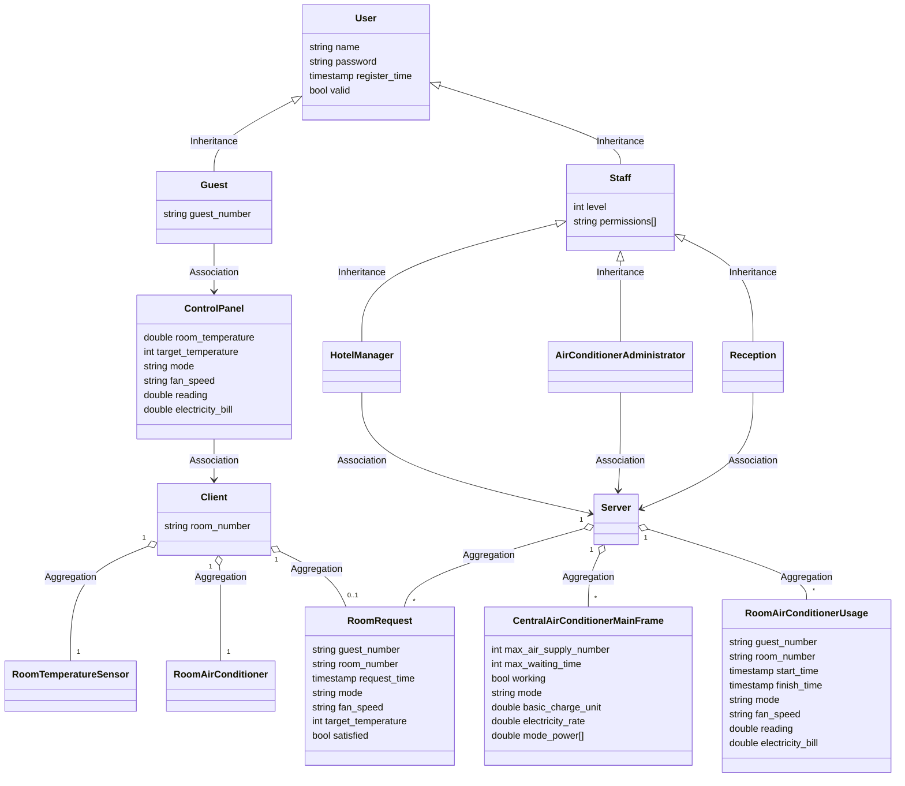
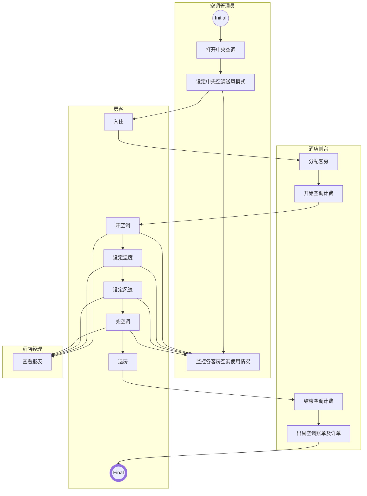

# 分布式温控系统的需求定义及其领域模型

## 业务介绍

## 业务流程

## 用户需求定义

注：实体加粗，属性斜体。

- **空调管理员**可依照季节设置**中央空调主机**的*送风模式* 、*开关状态* ，包括制冷模式或制热模式，以及*计费单位时间*（默认为秒）、*单位电费* （默认1元/度）与*各档风速单位时间耗电量* （默认高风0.01666度/秒，中风0.00833度/秒，低风0.00556度/秒）。
- **空调管理员**可实时监控各客房空调使用情况，即查看**请求队列** 和**送风队列**信息。

- **房客**入住酒店，**酒店前台**分配客房，**客房空调**开始计费。	
- **房客**退房，**客房空调**停止计费，**酒店前台**开具**账单**及**详单**。**账单**包含*空调用电总度数* 以及*空调总费用* ，**详单**包含各空调使用时段的*送风模式* 、*风速*、*送风时长*、*空调用电度数*、*空调费用*。

- **房客**可通过**控制面板**设定**室内机**的*开关状态*、*目标温度*、*送风模式*、*风速* ，查看**温度传感器**传来的*室温*  以及**服务器端**传来的*空调总费用*  。*送风模式* 为制冷模式时，*目标温度* 为18-25℃；为制热模式时，*目标温度* 为25-30℃。*目标温度* 缺省值可被设定，如25℃。*目标温度* 每秒最多调节1次，以一秒内最后发送的请求为准。*风速* 可设高风、中风、低风三档。
- **客户端**根据*目标温度*动态向**服务端**发出**送风请求**，包括*房客号* 、*房间号*、*发送时间*、*送风模式*、*风速* 、*目标温度*。*室温* 达到*目标温度*（即制冷模式下*室温* ≤*目标温度* ，制热模式下*室温* ≥*目标温度* ），发送*风速* 为无风的**送风请求**给**服务端**；当*室温* 超过*目标温度* 1℃时（即制冷模式下*室温*  ≥*目标温度* +1，制热模式下*室温*  ≤*目标温度* -1），发送指定**送风请求**给**服务端**。
- **服务器端**接收*送风模式*  与设定一致的**送风请求**，删除在**请求队列** 或**送风队列** 里老的（*房间号* 相同、*发送时间* 更早的）**送风请求**，若*风速* 不为无风，添加该**送风请求**至**请求队列**，并由此新建**空调使用记录**，包括*房客号* 、*房间号*、*开始时间*、*结束时间*、*送风模式*、*风速* 、*用电度数* 、*电费* 。收到新的**送风请求**或**室内机**关机，**空调使用记录**结束记录。维护**请求队列** 和**送风队列** ，使得*送风队列长度* < *最大送风队列长度* ，**请求队列**  中任意*送风请求风速* 均不高于**送风队列**中所有*送风请求风速*  ，且**请求队列**  中任意与**送风队列**中最低*送风请求风速* 相同的**送风请求**的*发送时间* 与当前时间之差不大于*最大等待时间* （默认值为s秒） ，以满足调度需求。**送风请求**从**送风队列**移动到**请求队列**后，其*发送时间* 更新为当前时间。
- **温度传感器**的测试输入数据构造方法为：
  - 空调开机，向设定温度变化，中风模式每分钟变化0.5℃，高风模式每分钟变化0.6℃，低风模式每分钟变化0.4℃。
  - 空调关机或待机，向初始温度变化，每分钟变化0.5℃。

- **酒店经理**可查看某时间范围内的格式化统计报表。

  报表分为**日报表**、**周报表**、**月报表**、**年报表**

  报表内容：*房客编号、房间号、发送送风请求时间、发送停止送风请求时间、发送请求时初始温度和目标温度、每次送风服务选择的送风模式、发送送风及停止送风请求次数、每次送风服务用电度数、每次送风服务费用、每日/周/月空调费用、每日/周/月空调用电度数*

## 领域模型

### 类图

### 活动图

