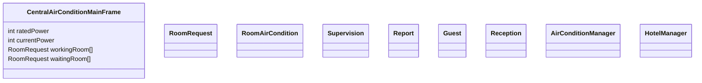
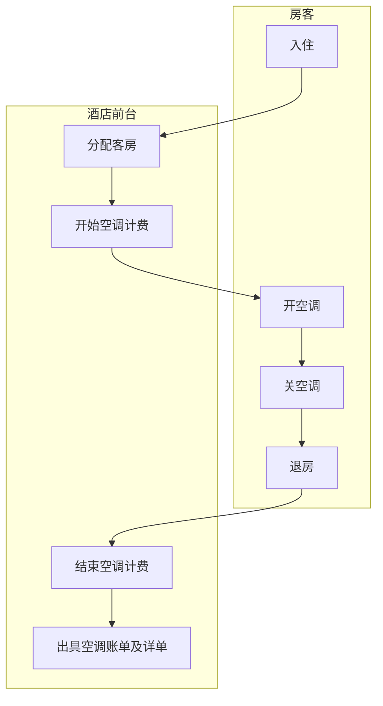

# 分布式温控系统的需求定义及其领域模型

## 业务介绍

## 业务流程

## 用户需求定义

## 领域模型

### 类图

```mermaid
classDiagram
      class CentralAirConditionMainFrame{
          int ratedPower
          int currentPower
          RoomRequest workingRoom[]
          RoomRequest waitingRoom[]
      }
      class RoomRequest{
      
      }
      class RoomAirCondition{
      
      }
      class Supervision{
      
      }
      class Report{
      
      }
      class Guest{
      
      }
      class Reception{
      
      }
      class AirConditionManager{
      
      }
      class HotelManager{
      
      }

```

### 活动图

```mermaid
graph TB
	
    A0-->B0
    B1-->A1
    A3-->B2
    subgraph 房客
    	A0[入住]
    	A1[开空调]-->A2[关空调]
    	A2-->A3[退房]
    end 
    
    subgraph 酒店前台
    	B0[分配客房]-->B1[开始空调计费]
    	B2[结束空调计费]-->B3[出具空调账单及详单]
    end
```

